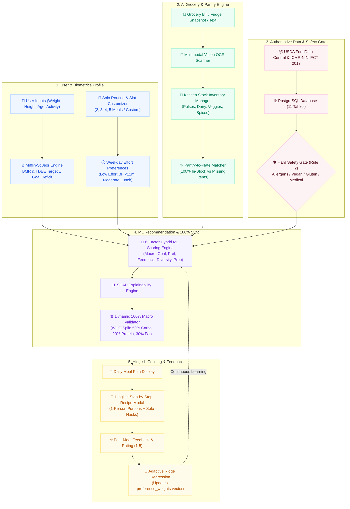

# DietSense — End-to-End System & User Journey Architecture Map

This document outlines the end-to-end system architecture, data flow, and user journey of **DietSense**.

Interactive Visual Studio: [`docs/system_map.html`](system_map.html)

---

## 🗺️ Visual System Architecture Map

---

## 5 Core System Layers

### 1. User & Biometrics Layer
- **Mifflin-St Jeor Formula**:
  - Men: `BMR = 10 × Weight(kg) + 6.25 × Height(cm) - 5 × Age + 5`
  - Women: `BMR = 10 × Weight(kg) + 6.25 × Height(cm) - 5 × Age - 161`
  - `TDEE = BMR × Activity Multiplier (1.2 to 1.9)`
  - Daily Target = `TDEE - 400 kcal` (Fat Loss Cut with 1200 kcal safety floor) or `TDEE + 300 kcal` (Lean Surplus).
- **Solo Cook Routine**: 1-person portion scaling with customizable meal slots (2-meal IF 16:8, 3-meal Classic, 4-meal Active, 5-meal Metabolic).

### 2. AI Grocery & Pantry Scanner (`Pantry-to-Plate`)
- **Multimodal OCR**: Detects food items from camera shots of fridge shelves, physical supermarket receipts, and digital delivery invoices (Blinkit/Zepto/Instamart).
- **Pantry Matching**: Ranks and flags recipes that can be cooked immediately using available stock (`✨ 100% Samaan Available`).

### 3. Safety Gate & Verified Data (Rule 1 & Rule 2)
- **Authoritative Data Sources**: 8,788 items from USDA FoodData Central + 528 items from ICMR-NIN (IFCT 2017).
- **Hard Safety Gate**: All dietary constraints and allergen flags are filtered out in SQL before scoring candidates.

### 4. 6-Factor Hybrid ML Scoring & Dynamic Validation
- **Scoring Equation**:
  $$\text{Score} = 0.30 \times \text{Macro} + 0.20 \times \text{Goal} + 0.20 \times \text{Pref} + 0.15 \times \text{Feedback} + 0.10 \times \text{Diversity} + 0.05 \times \text{Prep}$$
- **100% Dynamic Validation**: Target energy and macros are proportionally distributed across active meal slots and mathematically verified.

### 5. Hinglish Cooking & Adaptive Feedback
- **Hinglish Execution**: Step-by-step instructions with flame levels, metric/household measures, and solo kitchen cleanup hacks.
- **Adaptive Re-ranking**: Post-meal 1-5 ratings update the user's `preference_weights` vector in PostgreSQL.
